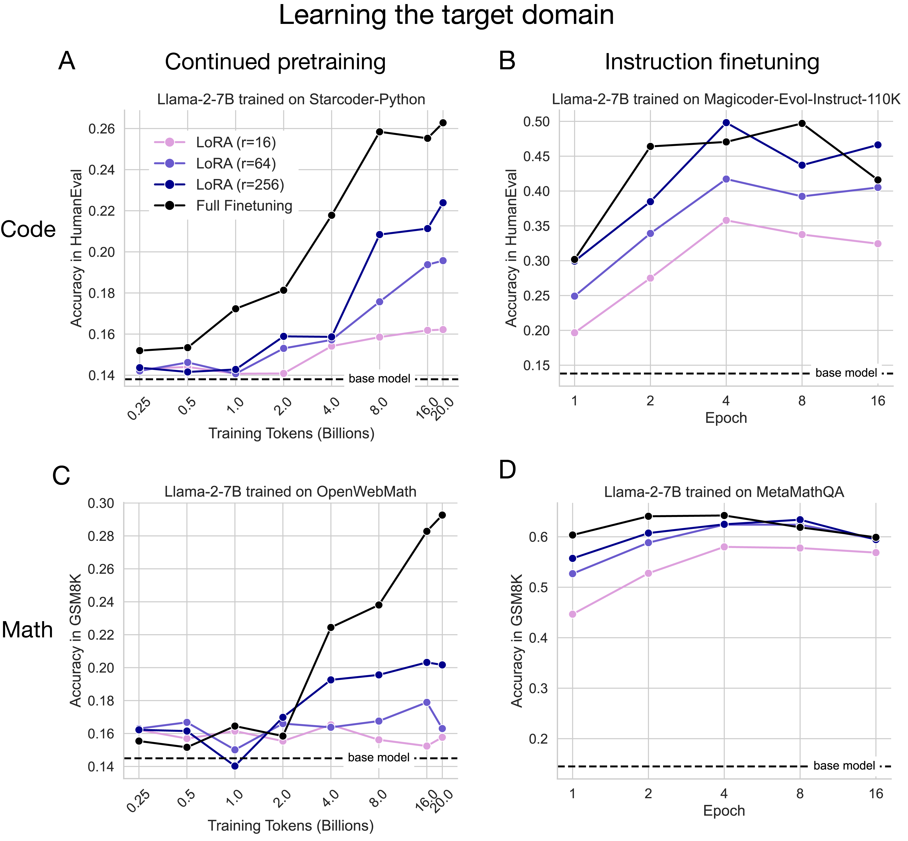
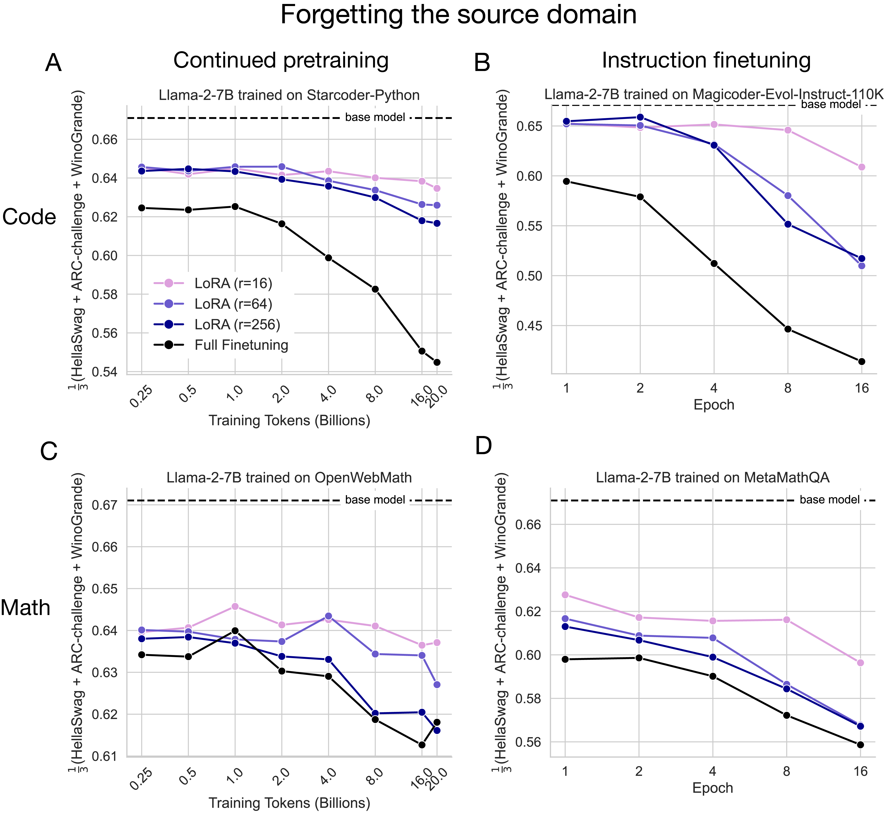

# LoRA Learns Less and Forgets Less

This minimal repo contains information about the paper ["LoRA Learns Less and Forgets Less"](https://arxiv.org/abs/2405.09673) (Biderman et al. TMLR, 2024).


# Abstract

Low-Rank Adaptation (LoRA) is a widely-used parameter-efficient finetuning method for
large language models. LoRA saves memory by training only low rank perturbations to
selected weight matrices. In this work, we compare the performance of LoRA and full
finetuning on two target domains, programming and mathematics. We consider both the
instruction finetuning (≈100K prompt-response pairs) and continued pretraining (≈20B
unstructured tokens) data regimes. Our results show that, in the standard low-rank settings,
LoRA substantially underperforms full finetuning. Nevertheless, LoRA better maintains the
base model’s performance on tasks outside the target domain. We show that LoRA mitigates
forgetting more than common regularization techniques such as weight decay and dropout;
it also helps maintain more diverse generations. Finally, we show that full finetuning learns
perturbations with a rank that is 10-100× greater than typical LoRA configurations, possibly
explaining some of the reported gaps. We conclude by proposing best practices for finetuning
with LoRA.





# Model Checkpoints and LoRA Adapters

We trained [Llama-2-7B](https://huggingface.co/meta-llama/Llama-2-7b-hf) using full finetuning and LoRA. Model checkpoints and LoRA adapters can be found on HuggingFace here: [LoRA-TMLR-2024](https://huggingface.co/LoRA-TMLR-2024). This work was done in collaboration with Databricks Mosaic AI Research.


| Setting | Dataset | HuggingFace Collection |
| --------| ------| ------ |
| Continued Pretraining - Code | [StarCoder-Python](https://huggingface.co/datasets/bigcode/starcoderdata) | [LoRA-TMLR-2024/continued-pretraining-code-starcoder-python](https://huggingface.co/collections/LoRA-TMLR-2024/continued-pretraining-code-starcoder-python-66f22ce3b26f416f21f58142) |
| Continued Pretraing - Math | [OpenWebMath](https://huggingface.co/datasets/open-web-math/open-web-math) | TBD |
| Instruction Finetuning - Code | [Magicoder-Evol-Instruct-110K](https://huggingface.co/datasets/ise-uiuc/Magicoder-Evol-Instruct-110K)| [LoRA-TMLR-2024/instruction-finetuning-code-magicoder-evol-instruct-110k](https://huggingface.co/collections/LoRA-TMLR-2024/instruction-finetuning-code-magicoder-evol-instruct-110k-66f224a800152f31e4942a3b) |
| Instruction Finetuning - Math | [MetaMathQA](https://huggingface.co/datasets/meta-math/MetaMathQA) | [LoRA-TMLR-2024/instruction-finetuning-math-metamathqa](https://huggingface.co/collections/LoRA-TMLR-2024/instruction-finetuning-math-metamathqa-66f31cc40fda6b6b938d33e2) |

All training was done using the Databricks MosaicML
[composer](https://github.com/mosaicml/composer), [streaming](https://github.com/mosaicml/streaming), and [llm-foundry](https://github.com/mosaicml/llm-foundry) repositories, as well as the HuggingFace [peft](https://huggingface.co/docs/peft/en/index) library.


# Updates

5/15/2024 - v1 of the paper shared on arXiv

8/13/2024 - Paper [accepted to TMLR](https://openreview.net/forum?id=aloEru2qCG)

9/23/2024 - arXiv v2 updated (same as TMLR camera ready version)

9/24/2024 - Model checkpoints uploaded to HuggingFace (WIP)

# Training Details


In all four scenarios below, we use the Llama-2-7B base model [meta-llama/Llama-2-7b-hf](https://huggingface.co/meta-llama/Llama-2-7b-hf). For
the CPT runs, we use the [meta-llama/Llama-2-7b-hf](https://huggingface.co/meta-llama/Llama-2-7b-hf) tokenizer, while for the IFT runs we use the
[meta-llama/Llama-2-7b-chat-hf](https://huggingface.co/meta-llama/Llama-2-7b-chat-hf) tokenizer.

## Code CPT (StarCoder-Python)

[StarCoder-Python](https://huggingface.co/datasets/bigcode/starcoderdata) (Li et al., 2023a) This dataset consists of permissively licensed repositories from GitHub, including Git commits, in 80+ programming languages. We chose the Python
subset and sub-sampled it to 20B tokens.

| Parameter                    | Value                                                                                   |
|------------------------------|-----------------------------------------------------------------------------------------|
| seq_len                      | 4096                                                                                    |
| optimizer                    | decoupled_lionw (betas=[0.9, 0.95])                                                     |
| learning_rate                | 1.0e-05 for LoRA and Full Finetuning                                                    |
| scheduler                    | inv_sqrt_with_warmup (t_scale=1000ba, t_warmup=1000ba, t_cooldown=5086ba, alpha_f_decay=1, alpha_f_cooldown=0) |
| weight_decay                 | 1.0e-06                                                                                 |
| precision                    | amp_bf16                                                                                |
| global_train_batch_size      | 192                                                                                     |
| device_train_microbatch_size | 6                                                                                       |
| gradient_clipping            | norm (threshold=1)                                                                      |
| num_gpus                     | 32                                                                                      |

## Math CPT (OpenWebMath)

[OpenWebMath](https://huggingface.co/datasets/open-web-math/open-web-math) (Paster et al., 2023) - This dataset contains 14.7B tokens derived from mathematical web pages from Common Crawl, correctly formatted to preserve mathematical content such as LaTeX equations. To match with the StarCoder-Python dataset, we trained on up to 20B tokens, repeating tokens beyond the first 14.7B. An analysis of this dataset shows that it contains a considerable amount of full English sentences.

| Parameter                    | Value                                                                                   |
|------------------------------|-----------------------------------------------------------------------------------------|
| max_seq_len                  | 4096                                                                                    |
| optimizer                    | decoupled_lionw (betas=[0.9, 0.95])                                                     |
| learning_rate                | 1.0e-05 for full finetuning, 4.0e-05 for LoRA                                           |
| scheduler                    | inv_sqrt_with_warmup (t_scale=1000ba, t_warmup=1000ba, t_cooldown=5086ba, alpha_f_decay=1, alpha_f_cooldown=0) |
| weight_decay                 | 0                                                                                       |
| precision                    | amp_bf16                                                                                |
| global_train_batch_size      | 192                                                                                     |
| device_train_microbatch_size | 6                                                                                       |
| gradient_clipping            | norm (threshold=1)                                                                      |
| num_gpus                     | 32                                                                                      |

## Code IFT (Magicoder-Evol-Instruct-110K)

[Magicoder-Evol-Instruct-110K](https://huggingface.co/datasets/ise-uiuc/Magicoder-Evol-Instruct-110K) (Wei et al., 2023) This dataset contains 72.97M tokens
of programming questions and answers. It reproduces the “Evol-Instruct” dataset of WizardCoder (Luo et al., 2023b) by iteratively prompting an LLM (GPT-4) to increase the difficulty of a set of question-answer pairs
from Code Alpaca (Chaudhary, 2023).

| Parameter                    | Value                                                                                   |
|------------------------------|-----------------------------------------------------------------------------------------|
| max_seq_len                  | 4096                                                                                    |
| optimizer                    | decoupled_lionw (betas=[0.9, 0.95])                                                     |
| learning_rate                | 2e-4 for rank r = 16, 64 and 1e-4 for r = 256 α = 2r = 512 (due to instabilities/loss spikes at 2e-4) |
| scheduler                    | cosine_with_warmup (alpha_f=0.01, t_warmup=0.1dur)                                      |
| weight_decay                 | 0                                                                                       |
| precision                    | amp_bf16                                                                                |
| global_train_batch_size      | 192                                                                                     |
| device_train_microbatch_size | 6                                                                                       |
| gradient_clipping            | norm (threshold=1)                                                                      |
| num_gpus                     | 32                                                                                      |

## Math IFT (MetaMathQA)

[MetaMathQA](https://huggingface.co/datasets/meta-math/MetaMathQA) (Yu et al., 2023) This dataset was built by bootstrapping mathematical
word problems from the training sets of GSM8K (Cobbe et al., 2021) and MATH (Hendrycks et al., 2021) by
rewriting the questions with variations using GPT-3.5. This dataset contains 395K question-answer pairs and
roughly 103M tokens.

| Parameter                    | Value                                                                                   |
|------------------------------|-----------------------------------------------------------------------------------------|
| seq_len                      | 1024                                                                                    |
| optimizer                    | decoupled_lionw (betas=[0.9, 0.95])                                                     |
| learning_rate                | Full finetuning: 1e-5, LoRA: 1e-4 for r = 16, 64, 5e-5 for r = 256 due to instabilities |
| scheduler                    | cosine_with_warmup (alpha_f=0.01, t_warmup=0.1dur)                                      |
| weight_decay                 | 0                                                                                       |
| precision                    | amp_bf16                                                                                |
| global_train_batch_size      | 768                                                                                     |
| device_train_microbatch_size | 24                                                                                      |
| gradient_clipping            | norm (threshold=1)                                                                      |
| num_gpus                     | 32                                                                                      |
```


